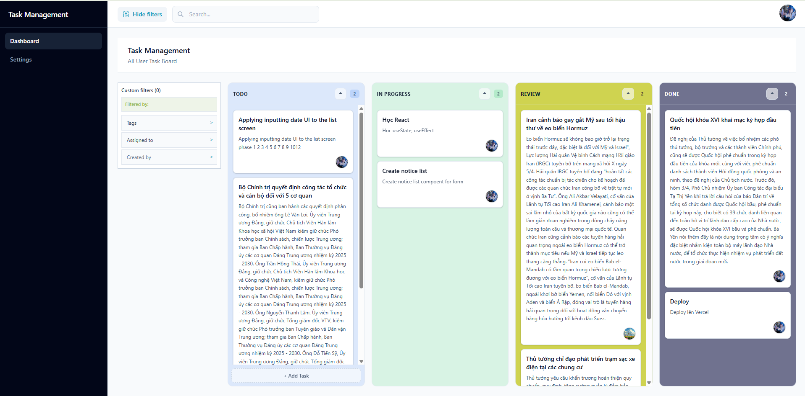
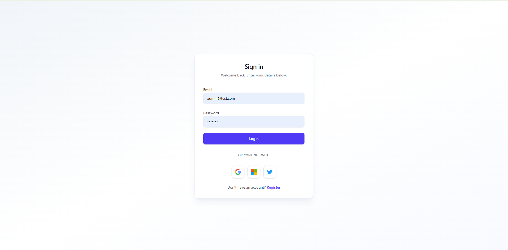

# Management Employee — Task Board

Ứng dụng web quản lý task dạng Kanban cho nhóm nội bộ: đăng nhập Firebase, board 4 cột, kéo-thả, lọc assignee/search, profile user trên Firestore.

> **English summary:** React 19 + Vite SPA with Firebase Auth/Firestore, TanStack Query, and @dnd-kit Kanban. Shared task board with paginated column loads, optimistic drag persist, auth-scoped query cache, Vitest unit/integration tests, and documented Firestore security rules.

---

## Demo & screenshots

| | |
|---|---|
| **Live demo** | task-management-h20vnnizg-kanban3.vercel.app |
| **Repository** | _[Thêm link GitHub]_ |

| Kanban board | Login |
|:---:|:---:|
|  |  |
| `/kanban` — 4 cột, filter, search | `/` — email + Google |

---

## Tech stack

| Layer | Công nghệ |
|--------|-----------|
| UI | React 19, React Router 7, Tailwind CSS 4 |
| Build | Vite 8, `@vitejs/plugin-react` |
| Data & auth | Firebase 12 (Auth, Firestore) |
| Server state | TanStack Query v5 |
| Drag & drop | @dnd-kit/core, @dnd-kit/sortable |
| Test | Vitest, Testing Library, jsdom |

**Firestore collections:** `Users/{uid}`, `Tasks/{taskId}` — xem `firestore.rules`, `FIRESTORE_RULES.md`.

---

## Tính năng

### Xác thực & routing
- Đăng ký / đăng nhập email + password (`Register`, `LoginPage`).
- Đăng nhập Google (popup) trên trang login.
- `AuthProvider` + `useAuth()` — một listener `onAuthStateChanged` cho cả app.
- `ProtectedRoute` bảo vệ `/kanban`, `/profile`.
- Trang start tùy chọn (`localStorage`) + redirect khi full reload (`main.jsx`).
- Đổi mật khẩu, avatar, export profile (`Profile` / `UserSetting`).
- Service `loginWithMicrosoft` có sẵn; nút Microsoft trên UI **chưa** gắn handler (nút Twitter tương tự).

### Kanban & task
- Board 4 cột: Todo, In Progress, Review, Done (`column_01` … `column_04` trên Firestore).
- Kéo-thả reorder / đổi cột; persist delta qua `updateTask` (chỉ task thay đổi `columnId` / `order`).
- Hủy kéo (thả ngoài / Esc): rollback UI từ snapshot, không gọi persist.
- Tạo / sửa / xóa task (`TaskModal`), gán assignee từ danh sách `Users`.
- Skeleton lúc load lần đầu; banner lỗi + Retry; empty state phân biệt “chưa có task” vs “bị filter”.

### Firestore & React Query
- Load ban đầu: **5 task/cột** (`TASKS_PAGE_SIZE`) + `startAfter` cursor (`getTasksByColumnPage`).
- Fallback full fetch 4 cột nếu paged load lỗi (`fetchKanbanInitialLoad`).
- Load thêm từng cột (“lazy load” trên `Column`).
- Query key kanban theo `authUid` — tránh flash task user trước.
- Sau login: `prepareQueriesAfterLogin` (invalidate profile + prefetch kanban).
- Sau logout: `clearAuthSessionQueries` xóa cache user-scoped.

### Lọc & UX
- Search URL `?q=` trên header (chỉ active ở `/kanban`).
- Filter assignee URL `?assignees=` + panel **Assigned to** (đếm task theo `userId`).
- Cảnh báo **「Không tải danh sách user」** nếu `getAllUsers` lỗi — board task vẫn hiển thị.
- Map lỗi Firebase → message inline (`mapFirebaseError`).

### Kiểm thử & tài liệu
- Vitest: pure helpers, smoke App, integration Kanban (mock auth/tasks).
- Checklist thủ công: `TEST_KANBAN_AUTH.md`, `TESTING_DND.md`.

---

## Kiến trúc (ASCII)

```
┌─────────────────────────────────────────────────────────────────┐
│  main.jsx: BrowserRouter, QueryClientProvider, AuthProvider      │
└───────────────────────────────┬─────────────────────────────────┘
                                │
┌───────────────────────────────▼─────────────────────────────────┐
│  App.jsx — Routes                                                │
│    /  → RootRoute (login hoặc redirect start page)               │
│    /register, /kanban (Protected), /profile (Protected)          │
└───────────────┬─────────────────────────────┬───────────────────┘
                │                             │
     ┌──────────▼──────────┐       ┌──────────▼──────────────────┐
     │  Login / Register   │       │  Layout + KanbanBoard        │
     │  firebase authService│       │  ┌────────────┬────────────┐ │
     └──────────┬──────────┘       │  │useKanbanTasks│useKanbanDnD│ │
                │                  │  │ (Query+local │ (dnd-kit +  │ │
                │                  │  │ tasksByColumn)│ persist)  │ │
                │                  │  └──────┬───────┴──────┬───────┘ │
                │                  │         │              │         │
                └──────────────────┼─────────┼──────────────┼─────────┘
                                   │         │              │
                    ┌──────────────▼─────────▼──────────────▼──────────┐
                    │  services/firebase/*                                │
                    │    app.js · authService · userService · taskService │
                    └──────────────┬─────────────────────────────────────┘
                                   │
                    ┌──────────────▼──────────────┐
                    │  Firebase Auth + Firestore   │
                    │  Users · Tasks               │
                    └─────────────────────────────┘

Dual source Kanban:
  TanStack Query  ──initial/sync──►  tasksByColumn (React state)
       ▲                                    │
       │         drag / create / load-more   │
       └──────── refetch / setState ─────────┘
```

---

## Cài đặt

### Yêu cầu
- Node.js 18+
- Project Firebase (Auth + Firestore)

### Biến môi trường

```bash
cp .env.example .env
```

Điền các giá trị từ **Firebase Console → Project settings → Your apps**:

```env
VITE_FIREBASE_API_KEY=
VITE_FIREBASE_AUTH_DOMAIN=
VITE_FIREBASE_PROJECT_ID=
VITE_FIREBASE_STORAGE_BUCKET=
VITE_FIREBASE_MESSAGING_SENDER_ID=
VITE_FIREBASE_APP_ID=
VITE_FIREBASE_MEASUREMENT_ID=
```

### Firestore (khuyến nghị)

```bash
firebase deploy --only firestore
```

Rules & composite index: `firestore.rules`, `firestore.indexes.json` — chi tiết `FIRESTORE_RULES.md`.

Bật trên Firebase Console: **Email/Password**, **Google** (nếu dùng nút Google).

---

## Chạy dự án

```bash
npm install
npm run dev      # http://localhost:5173
npm run build
npm run preview
```

### Test

```bash
npm test         # Vitest watch
npm run test:run # một lần (CI)
npm run lint
```

---

## Challenges & Solutions

Phần này ghi lại những chỗ mình vấp thật khi làm board — không phải “best practice slide”, mà là bài học sau khi debug.

### Hai nguồn state: `useKanbanTasks` + `useKanbanDnD`

Ban đầu mình tưởng chỉ cần TanStack Query là đủ: fetch task xong render list. Nhưng @dnd-kit cần state cột thay đổi **ngay** khi kéo, và `useSortable` phụ thuộc `items` ổn định. Vì vậy board render từ `tasksByColumn` (React state), còn Query chỉ lo **tải / refetch** (`fetchKanbanInitialLoad`, load-more, refresh sau lỗi persist).

Hệ quả: có hai “sự thật” tạm thời. Mình phải ghi rõ luồng sync — Query trả data → `useLayoutEffect` gán vào state; drag → `setTasksByColumn`; persist xong → refetch hoặc cập nhật snapshot. Khi đổi user, reset state local **và** query key theo `authUid`, không chỉ invalidate một key chung. Bài học: không phải lúc nào cũng “single source of truth”; đôi khi phải chọn source phù hợp từng phase (server vs interaction).

### Persist amplification (đã fix)

Lỗi ngớ ngẩn nhất: sau mỗi lần thả task, app gọi `updateTask` cho **cả bốn cột** hoặc toàn bộ task trên board. Network đầy, Firestore rules cũng dễ fail, UX chậm.

Nguyên nhân là persist so sánh kiểu “ghi lại toàn board” thay vì **delta**. Mình tách `getKanbanDragPersistUpdates`: map `taskId → (columnKey, index)` trước và sau drag, chỉ push task có `columnId` hoặc `order` đổi. Kéo sang cột khác thường chỉ một document; reorder trong cột thì vài task phía sau đổi index — đúng, nhưng vẫn nhỏ hơn rất nhiều so với quét 4 cột. Học được: optimistic UI không đồng nghĩa optimistic **write** toàn cục.

### `onAuthStateChanged` trùng và cache key

Có giai đoạn vừa `AuthProvider` vừa hook riêng đều subscribe `onAuthStateChanged`, vừa query kanban không gắn `uid` — logout đăng nhập user khác vẫn **flash** task cũ vài trăm ms.

Fix: một listener trong `AuthContext`; query key `kanbanInitialLoadKey(authUid)`, `currentUserProfileKey(authUid)`; logout gọi `clearAuthSessionQueries` (`removeQueries` các root user-scoped). Login thì `prepareQueriesAfterLogin` prefetch kanban. Mình hiểu cache React Query không “tự biết” data thuộc user nào — phải encode trong key và dọn khi session đổi.

### `orderBy(documentId())` thay vì field `order`

Ban đầu paginate theo `orderBy("order")`. Task cũ thiếu field `order` bị **rớt khỏi query**, board trông như mất data. Đồng thời sort string `"10"` vs `"2"` không phản ánh thứ tự kéo trên UI.

Giải pháp hiện tại: `where("columnId")` + `orderBy(documentId())` + `limit(5)` + `startAfter` — thứ tự ổn định cho mọi document, kèm composite index `columnId` + `__name__` trong `firestore.indexes.json`. Field `order` vẫn ghi khi drag để sau này có thể sort đúng ý product, nhưng **phân trang** không phụ thuộc field optional nữa. Bài học: query Firestore phải design cùng schema thực tế, không cùng lý tưởng schema mới.

### Drag cancel và `dragOver` rỗng

Cố preview bằng cách `setTasksByColumn` trong `dragOver` → @dnd-kit đo layout liên tục → “Maximum update depth”. Mình chuyển preview sang `DragOverlay`, `dragOver` no-op, snapshot ở `dragStart`, `applyDragMove` chỉ ở `dragEnd`; cancel / thả ngoài restore snapshot, không persist. Đây là lần mình học đọc issue library thay vì thêm `useEffect` chữa cháy.

---

## Roadmap

## Roadmap

1. **Gắn đăng nhập Microsoft** — `loginWithMicrosoft` đã có trong `authService`; wire nút trên `LoginPage` và kiểm tra provider Firebase.
2. **E2E + CI** — Playwright (hoặc tương đương) cho luồng login → kanban → drag; chạy `test:run` trên GitHub Actions.
3. **Quyền kéo task theo role** — rules hiện owner-only write (`userId`); mở rộng admin/manager hoặc Cloud Functions nếu cần kéo task người khác (xem trade-off trong `FIRESTORE_RULES.md`).

---

## Cấu trúc thư mục (rút gọn)

```
src/
  context/AuthContext.jsx
  hooks/          useKanbanTasks, useKanbanDnD, useTaskSearch, …
  lib/            authQueryCache, kanbanAssigneeFilter
  pages/          KanbanBoard, LoginPage, Profile
  services/firebase/
  utils/mapFirebaseError.js
```

---

## License

Private / portfolio — cập nhật license khi public repo.
